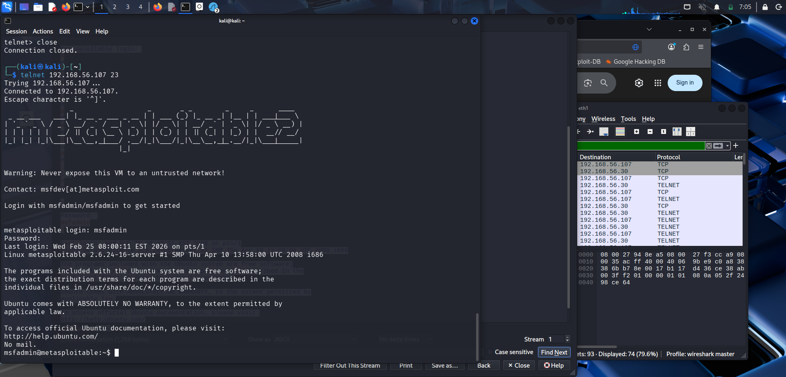
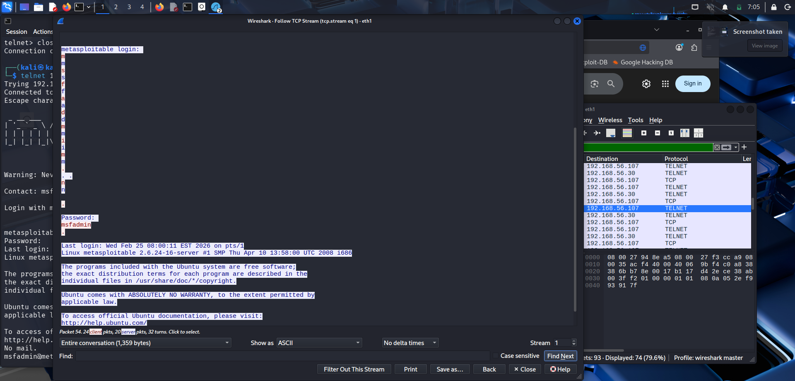
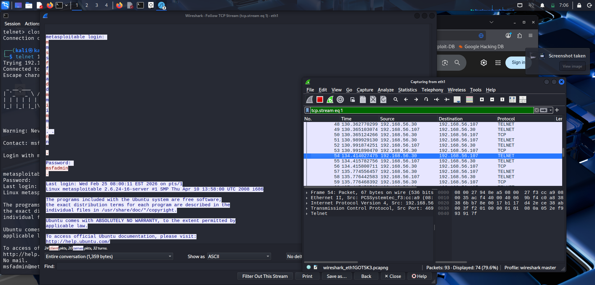

# 📡 Telnet Exploitation Lab — Writeup

<!-- Badges -->


> 📁 **Part of the [`kali-linux-lab`](./README.md) repository** — read the [main Kali lab writeup](./README.md) first for full context.


---

## 🎯 Objective

> **In plain English:** Telnet is an old way of remotely controlling computers. It has one massive flaw — it sends everything you type, including your password, completely unencrypted over the network. Anyone watching the traffic can read it like a text message.

This lab demonstrates two things:

1. How easy it is to log into a system running Telnet
2. How Wireshark can capture and expose credentials sent over Telnet in real time

---

## 🏗️ Lab Environment

```
┌─────────────────────────────┐        ┌──────────────────────────────┐
│        Kali Linux           │        │      Metasploitable 2        │
│     192.168.56.30           │◄──────►│      192.168.56.107          │
│       (Attacker)            │        │        (Target)              │
│   Running: Wireshark        │        │   Running: Telnet on port 23 │
└─────────────────────────────┘        └──────────────────────────────┘

Network interface: eth1
Capture file: wireshark_eth1GOT5K3.pcapng
```

**Why this is safe:** Both machines run inside VirtualBox on a host-only network. No real systems involved.

---

## 🛠️ Tools Used

| Tool                                                                                                           | Purpose                             |
| -------------------------------------------------------------------------------------------------------------- | ----------------------------------- |
|  | Attacker machine                    |
|                                      | Connect to the target service       |
|    | Capture and inspect network traffic |
|                 | Intentionally vulnerable target VM  |

---

## 🔍 Phase 1 — Identifying the Telnet Service

From the earlier Nmap scan of the target, port 23 (Telnet) was found open:

```bash
┌──(mosses㉿kali)-[~]
└─$ nmap -sV -p 23 192.168.56.107

PORT   STATE SERVICE VERSION
23/tcp open  telnet  Linux telnetd
```

> **Why is Telnet dangerous?** Telnet was designed in 1969 — before security was a concern. It transmits every character typed, including usernames and passwords, in plain unencrypted text. SSH replaced it for exactly this reason, but many old and misconfigured systems still run it.

---

## 💥 Phase 2 — Connecting via Telnet

With Wireshark already running and capturing on `eth1`, I connected to the target:

```bash
┌──(kali㉿kali)-[~]
└─$ telnet 192.168.56.107 23

Trying 192.168.56.107 ...
Connected to 192.168.56.107.
Escape character is '^]'.
```

The Metasploitable 2 banner appeared immediately:

```
 _          _
| |__  ___ | |  ___
| '_ \/ _ \| | / _ \   metasploitable2
| | | | (_) | ||  __/   linux
|_| |_|\___/|_| \___|

Warning: Never expose this VM to an untrusted network!

Contact: msfdev[at]metasploit.com

Login with msfadmin/msfadmin to get started

metasploitable login:
```

> **Note:** The banner literally tells you the credentials — `msfadmin/msfadmin`. This is intentional for a training VM. In a real engagement, you would need to guess or brute-force credentials.

### Login

```bash
metasploitable login: msfadmin
Password: msfadmin

Last login: Wed Feb 25 08:00:11 EST 2026 on pts/1
Linux metasploitable 2.6.24-16-server #1 SMP Thu Apr 10 13:58:00 UTC 2008 i686

msfadmin@metasploitable:~$
```

✅ **Shell access obtained on Metasploitable 2 via Telnet.**

---

## 🦈 Phase 3 — Wireshark: Capturing the Password in Plaintext

While the Telnet session was active, Wireshark was capturing all traffic on `eth1`.

### Capture Filter Used

```
tcp.stream eq 1
```

This isolates the single TCP stream for the Telnet session — showing every packet exchanged between Kali (`192.168.56.30`) and the target (`192.168.56.107`).

### What Wireshark Captured

Using **Follow TCP Stream**, the entire Telnet conversation was visible in ASCII — including the password:

```
metasploitable login:
[keystrokes captured one character at a time]

Password:
msfadmin          ← PASSWORD VISIBLE IN PLAINTEXT

Last login: Wed Feb 25 08:00:11 EST 2026 on pts/1
Linux metasploitable 2.6.24-16-server #1 SMP Thu Apr 10 13:58:00 UTC 2008 i686
```

**Total conversation size captured: 1,359 bytes across 93 packets (74 displayed, 79.6%)**

The Wireshark packet list confirmed TELNET protocol packets flowing in both directions:

| Packet | Time       | Source            | Destination        | Protocol                     |
| ------ | ---------- | ----------------- | ------------------ | ---------------------------- |
| 48     | 130.36     | 192.168.56.30     | 192.168.56.107     | TELNET                       |
| 49     | 130.37     | 192.168.56.107    | 192.168.56.30      | TELNET                       |
| 51     | 130.99     | 192.168.56.30     | 192.168.56.107     | TELNET                       |
| 53     | 130.99     | 192.168.56.30     | 192.168.56.107     | TELNET                       |
| **54** | **134.41** | **192.168.56.30** | **192.168.56.107** | **TELNET ← password packet** |

> **Plain English:** Each character you type in Telnet is sent as a separate packet. Anyone on the same network running Wireshark can reconstruct everything you typed — character by character — including your password.

---

## 📸 Evidence

### Screenshot 1 — Telnet Shell Access

> Kali terminal showing successful Telnet login to Metasploitable 2 as `msfadmin`. The Metasploitable banner, login prompt, and active shell `msfadmin@metasploitable:~$` are all visible. Wireshark is capturing in the background on the right.



---

### Screenshot 2 — Wireshark: Password Captured in Plaintext

> Wireshark's "Follow TCP Stream" view showing the full Telnet conversation. The password `msfadmin` is clearly highlighted and visible in the stream — sent with zero encryption.



---

### Screenshot 3 — Wireshark: Live Packet Capture

> Full Wireshark window showing live capture on `eth1`, filtering TELNET packets between `192.168.56.30` and `192.168.56.107`. The highlighted packet 54 is where the password was transmitted. The packet details panel shows: Ethernet II → IPv4 → TCP → Telnet layers.



---

## 🔐 Key Vulnerability Explained

| Property                    | Telnet                          | SSH (the safe alternative)      |
| --------------------------- | ------------------------------- | ------------------------------- |
| Encryption                  | ❌ None — plaintext             | ✅ Full end-to-end encryption   |
| Password visible on network | ❌ Yes — anyone can read it     | ✅ No — encrypted               |
| Still in use today          | ⚠️ On old/misconfigured systems | ✅ Industry standard since 1995 |
| Should you use it?          | 🔴 Never on a real network      | ✅ Always use SSH instead       |

---

## 🛡️ Defensive Recommendations

| Finding                                 | Severity    | Fix                                                       |
| --------------------------------------- | ----------- | --------------------------------------------------------- |
| Telnet running on port 23               | 🔴 Critical | Disable Telnet immediately — `systemctl disable telnet`   |
| Credentials sent in plaintext           | 🔴 Critical | Replace with SSH — `apt install openssh-server`           |
| Default credentials `msfadmin/msfadmin` | 🔴 Critical | Change all default passwords immediately                  |
| No network monitoring                   | 🟡 Medium   | Deploy Wireshark/Zeek/Snort to detect credential sniffing |

### How to Disable Telnet on a Real Linux System

```bash
# Check if telnet is running
systemctl status telnetd

# Disable and stop it
sudo systemctl disable telnetd
sudo systemctl stop telnetd

# Block the port with a firewall rule
sudo ufw deny 23/tcp

# Verify it's closed
nmap -p 23 localhost
# Expected: 23/tcp closed telnet
```

---

## 🧠 What I Learned

- **Telnet is not just outdated — it is actively dangerous.** The credentials were captured by Wireshark in under 3 seconds with zero effort. Any attacker on the same network segment could do this.

- **Wireshark's "Follow TCP Stream" is incredibly powerful.** It reconstructs an entire conversation from raw packets — turning hundreds of packet fragments into readable human text. This is the same technique attackers use on compromised networks.

- **Protocol matters as much as password strength.** A 50-character password sent over Telnet is still fully visible. Security is not just about strong passwords — it is about encrypting the channel they travel through.

- **Real systems still run Telnet.** Industrial equipment, old routers, legacy servers. This is not just a training exercise — Telnet exposure is a real finding in real penetration tests.

- **Wireshark shows you the network as it really is.** Seeing your own password in plain text in the packet stream is a visceral lesson that no textbook can replicate.

---

## 📚 References

- [Wireshark User Guide — Follow TCP Stream](https://www.wireshark.org/docs/wsug_html_chunked/ChAdvFollowStreamSection.html)
- [CVE Database — Telnet vulnerabilities](https://cve.mitre.org/cgi-bin/cvekey.cgi?keyword=telnet)
- [RFC 854 — Telnet Protocol Specification (1983)](https://tools.ietf.org/html/rfc854)
- [NIST — Telnet Security Guidance](https://nvlpubs.nist.gov/nistpubs/Legacy/SP/nistspecialpublication800-115.pdf)

---

<div align="center">

[](https://mossesmuwa.github.io/My-portfolio/)
[-557C94?style=for-the-badge&logo=kalilinux&logoColor=white>)](./README.md)
[](https://github.com/Mossesmuwa)

</div>
